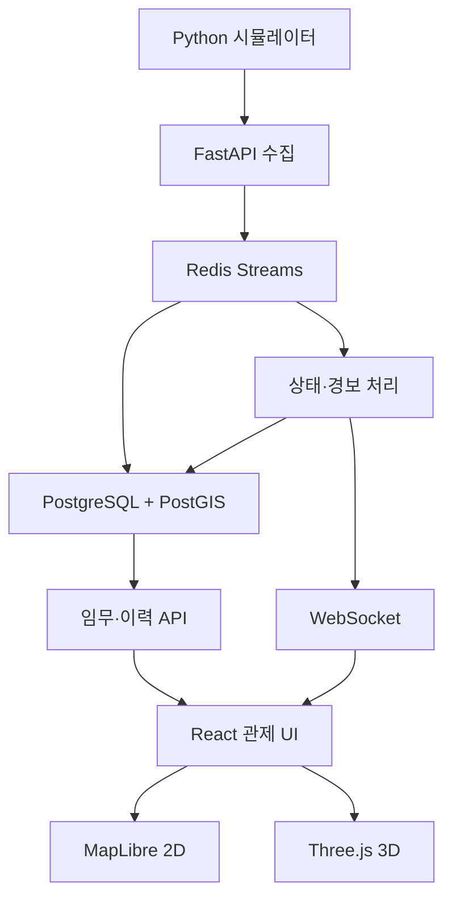

# AeroOps 종합 기획서

## 프로젝트 정의

AeroOps는 가상 드론 10대의 위치·자세·기체 상태를 실시간 수집하여 임무 상태, 이상 이벤트, 운용 이력을 관리하는 관제 플랫폼이다. 전체 기체는 2D 지도에 심벌로 표시하고 선택 기체만 3D 모델로 상세 표현한다.

## 목표 직무

- 드론·무인체계 관제 SW
- 지휘통제·임무계획 백엔드
- 실시간 텔레메트리 데이터 플랫폼
- GIS 기반 운영 시스템

## 핵심 기능

1. 다중 드론 텔레메트리 생성·수집
2. 2D 위치·방향·경로·상태 관제
3. 임무·경로·지오펜스 관리
4. 배터리·통신·구역 이탈 경보
5. 선택 기체의 roll·pitch·yaw 3D 표현
6. 2D·3D·차트 동기화 이력 재생
7. 역할 기반 접근 제어와 감사 로그
8. 처리량·지연·오류 관측

## 전체 구조

## 기술 스택

| 영역 | 기술 |
|---|---|
| 프론트 | React, TypeScript, Vite, MapLibre, Three.js |
| 백엔드 | FastAPI, Pydantic, WebSocket |
| 이벤트 | Redis Streams |
| 데이터 | PostgreSQL, PostGIS |
| 관측성 | Prometheus, Grafana |
| 실행 | Docker Compose, GitHub Actions |

## 성공 기준

- 10대 × 1 Hz를 20분 이상 안정 처리
- 수집부터 화면 반영까지 로컬 p95 500 ms 이내
- 중복·역순·범위 오류 메시지 판별
- 2D 위치와 3D 자세의 타임스탬프 동기화
- 통신 단절 시 마지막 위치와 수신 시각 보존
- 주요 변경 행위 감사 기록

## 제외 범위

실제 기체 제어, SLAM, 군집제어, 실시간 영상 AI, CAD급 모델링, Kubernetes는 MVP에서 제외한다.

[[01_프론트엔드_아키텍처]]
[[02_백엔드_아키텍처]]
[[03_데이터베이스_아키텍처]]
[[04_인프라_네트워크_클라우드]]
[[05_데이터엔지니어링_아키텍처]]

