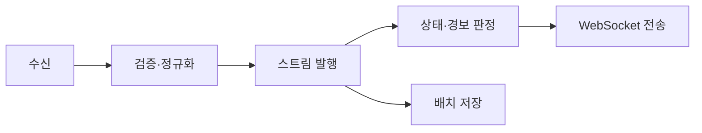

# 백엔드 아키텍처

## 모듈

| 모듈 | 책임 |
|---|---|
| Ingestion | 스키마·범위 검증, 중복 판별, 이벤트 발행 |
| Telemetry | 최신 상태와 기간별 이력 조회 |
| Mission | 임무·경로·구역·상태 전이 |
| Alert | 배터리·통신·지오펜스 규칙 판정 |
| Realtime | WebSocket 연결·구독·재연결 지원 |
| Identity | 인증, 역할·권한 |
| Audit | 중요 명령과 설정 변경 기록 |

초기에는 단일 FastAPI 애플리케이션 내부의 모듈형 모놀리스로 구현한다. Redis와 DB만 별도 프로세스로 둔다.

## 처리 흐름

## API 범위

- `POST /telemetry`: 시뮬레이터 데이터 수신
- `GET /assets/{id}/latest`: 최신 상태
- `GET /assets/{id}/telemetry`: 기간별 이력
- `/missions`: 임무 CRUD와 상태 변경
- `/geofences`: 공간 구역 관리
- `/alerts`: 경보 조회·확인
- `/ws/operations`: 최신 상태와 경보 구독

## 신뢰성 규칙

- `asset_id + timestamp + sequence`로 중복을 판정한다.
- 원본 이벤트 시각과 서버 수신 시각을 모두 저장한다.
- 역순 데이터는 원본 보존 후 최신 상태 갱신 여부를 분리 판정한다.
- 오래 걸리는 분석을 요청 경로에서 실행하지 않는다.

