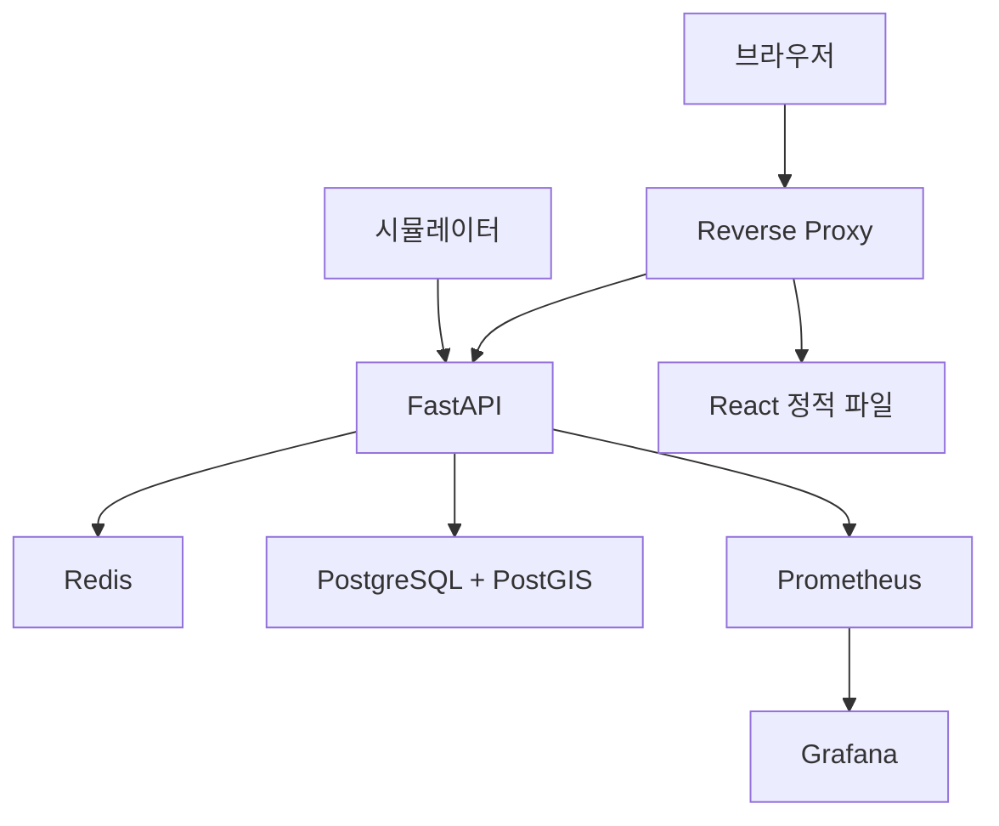

# 인프라·네트워크·클라우드 아키텍처

## 로컬 구성

Docker Compose 서비스는 `web`, `api`, `simulator`, `postgres`, `redis`, `prometheus`, `grafana`, 선택적 `reverse-proxy`로 구성한다.

## 네트워크 경계

- 외부 노출은 reverse proxy 하나로 제한한다.
- DB와 Redis는 내부 네트워크에서만 접근한다.
- 브라우저 요청과 WebSocket은 TLS 종단을 거친다.
- 서비스 계정과 사용자 계정을 분리하고 최소 권한을 적용한다.
- 비밀값은 저장소에 커밋하지 않고 환경별 secret으로 주입한다.

## 클라우드 확장

MVP는 로컬 Compose가 기준이다. 데모 배포 시 컨테이너 서비스, 관리형 PostgreSQL, 관리형 Redis, 객체 저장소를 사용할 수 있다. 실시간 수집과 관제 API는 동일 리전에 두며 원본 텔레메트리 백업만 객체 저장소로 이동한다.

## 운영 기준

- `/health/live`, `/health/ready` 분리
- JSON 구조 로그와 request/correlation ID
- CPU·메모리·수집량·처리 지연·WebSocket 연결 수 수집
- DB 백업 및 복구 절차 문서화
- GitHub Actions에서 lint, test, build, container scan 실행

