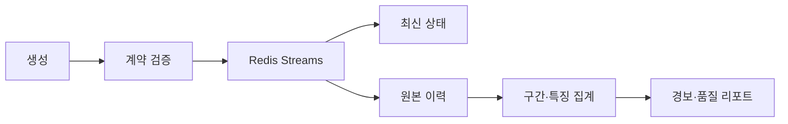

# 데이터엔지니어링 아키텍처

## 데이터 계약

`TelemetryFrame`은 `schema_version`, `asset_id`, `mission_id`, `event_time`, `received_at`, `sequence_no`, 위치, 속도, heading, roll·pitch·yaw, 배터리, RSSI, 비행 모드를 포함한다.

## 파이프라인

## 품질 규칙

| 차원 | 검사 |
|---|---|
| 완전성 | 필수 필드와 결측률 |
| 유효성 | 좌표·각도·배터리·RSSI 범위 |
| 유일성 | asset·sequence 중복 |
| 적시성 | event와 received 시각 차이 |
| 순서성 | 기체별 sequence·timestamp 역전 |
| 일관성 | heading과 yaw 정의, 단위·좌표계 |

## 장애 시나리오

시뮬레이터에서 중복, 지연, 역순, 결측, 급격한 배터리 하락, GPS 점프, 통신 단절을 주입한다. 각 시나리오의 기대 처리 결과를 테스트 픽스처로 고정한다.

## 분석 데이터

MVP 특징은 배터리 소모율, 속도·고도 변화율, 수신 지연, RSSI 이동평균, 지오펜스 거리로 제한한다. 초기 경보는 설명 가능한 규칙 기반으로 구현하고 ML은 후속 비교 실험으로 둔다.

## 재현성

- schema·rule·simulator 버전을 기록한다.
- 원본을 덮어쓰지 않고 분석 결과에 버전을 연결한다.
- 고정 seed 시나리오로 데모와 회귀시험을 재현한다.

